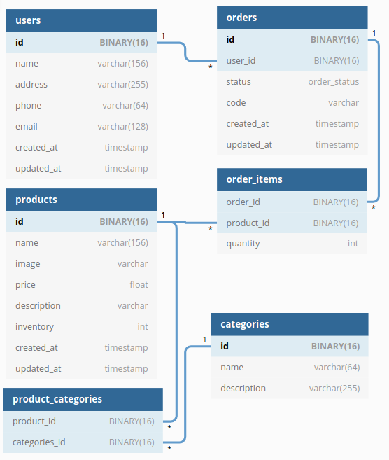

# Code Overview

- [Code Overview](#code-overview)
  - [Interesting Dependencies](#interesting-dependencies)
  - [Database](#database)
  - [Application Structure](#application-structure)
  - [Error Handling](#error-handling)
  - [Databases](#databases)
  - [Basic Requests](#basic-requests)

## Interesting Dependencies

- [expressjs](https://github.com/expressjs/express) - The server for handling and routing HTTP requests

## Database



## Application Structure

- `index.js` The entry point to our application. This file defines our express server and connects it to all the middlewares needed. It also requires the routes and models we'll be using in the application.
- `api/` This folder contains the route definitions for our API.
- `migrations/` Here we have some migrations (in SQL for easy portability) to run before start the server.
- `server/` This folder contains configuration for the app as well as a central location for configuration/environment variables.
- `service/` This folder contains the actions and queries for each Table.

## Error Handling

Notice that the code don't use `console.log()`, instead uses a custom logger built with `winston` and `morgan`. All the important events are saved to `logs/` folder and shows in the terminal. So if you run into any error and want to check the available info, visit the `logs/` folder!

If an error happens the server must restart as is using `nodemon` in dev and `pm2` in production. Also note I used extensively `try...catch` to avoid Unhandled Errors.

In `api/v1/index.js`, we define a error-handling middleware for handling inputs: `ValidationError`. This middleware will respond with a 422 status code and format the response to have error messages the clients can understand

## Databases

Its made in MySQL. I also don't use an ORM as we usually don't need it if we know some SQL query build (or can use Google).

I defined some migrations to bootstrap a new server, you can use it by running `npm run set-db:dev` and have the migrations and seed run.

For databases I recommend using Heroku Free Tier. If you want to check the changes in DBs, I recommend [pgweb](https://pgweb-demo.herokuapp.com/).

## Basic Requests

- GET `/ping`

```sh
curl https://fast-shopping-backend.herokuapp.com/ping
```

<!--
- POST `/api/v1/auth/signup`

```sh
curl --data-urlencode "name=Israel Antonio Rosales Laguan" \
  -d "email=user@mail.com&password=5236987410." \
  https://fast-shopping-backend.herokuapp.com/api/v1/auth/signup
```

- POST `/api/v1/auth/login`

```sh
curl -d "email=user@mail.com&password=5236987410." \
  https://fast-shopping-backend.herokuapp.com/api/v1/auth/login
``` -->
